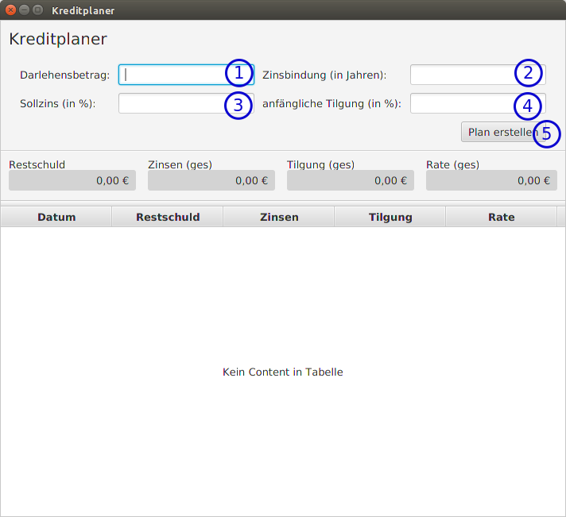
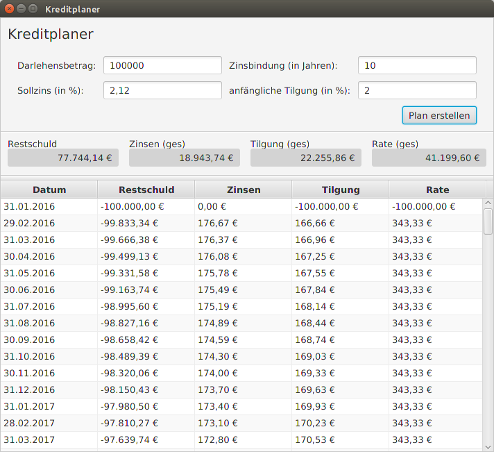
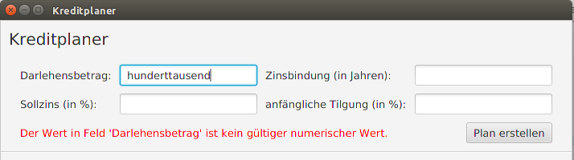

Loan Planer
===

The Loan Planer is a simple form-based application to create a payment plan for a loan. You can enter the amount of the loan, its lifetime (in years), the rate of interest and the principal rate. The program will calculate the rate for each month including:
 * the date of the rate,
 * the remaining loan in that month,
 * the absolute interest to be paid in that month,
 * the principal in that month and
 * the payment to be paid.
 
The last entry shows the remaining debit, the sum of paid interests and the sum of principal.

Note, that all rates are rounded with precision 2.

## Requirements
To run this application you need Java 8.
To compile the Loan Planer from its sources you can use maven3. 
Just run:
```
mvn clean install
```

## Start Application

To start this application run:
```
java -jar loan-planer.jar
```

Getting a loan plan in five steps:



### Step 1


Enter the loan's amount.

### Step 2

Enter the loan's lifetime.

*When you enter a decimal digit, the values are interpreted as month, where 0.5 means 6 month. In case the fractional digit cannot be converted to a full month, it will be rounded.*

### Step 3

Enter the annual rate of interest as decimal (in percent) e.g. "2.12" or "2,12".

### Step 4

Enter the annual rate of principal as decimal (in percent) e.g. "2.12" or "2,12".

### Step 5

Click the 'Plan berechnen' button.

### Done

The application will present the calculated loan plan: 



## Warnings

When entering an invalid value You will get a warning message as shown here:



